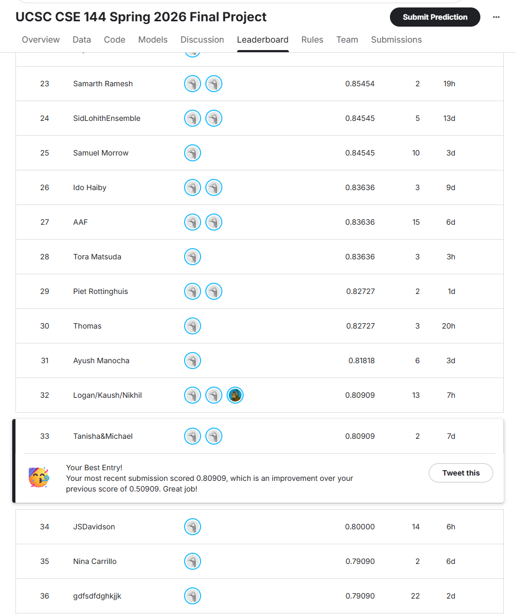

# CSE 144 Final Project — Transfer Learning

100-class image classification using EfficientNet-V2-M fine-tuned on the [UCSC CSE 144 Spring 2026 Kaggle competition](https://www.kaggle.com/competitions/ucsc-cse-144-spring-2026-final-project) dataset.

## Repository Structure

```
├── train.py                  # Two-phase fine-tuning script
├── inference.py              # Generates submission.csv from trained weights (with TTA)
├── cse144_final.ipynb        # Exploratory notebook
├── sample_submission.csv     # Submission format template
└── requirements.txt          # Python dependencies
```

Model weights (`best_model.pth`) are not included in this repo — see [Pretrained Weights](#pretrained-model-weights) below.

---

## Setup

**Requirements:** Python 3.9+

```bash
python3 -m venv venv
source venv/bin/activate        # Windows: venv\Scripts\activate
pip install -r requirements.txt
```

---

## Dataset

Download the dataset from the [Kaggle competition page](https://www.kaggle.com/competitions/ucsc-cse-144-spring-2026-final-project) and place it so the directory structure looks like this (relative to `train.py`):

```
final_project/
├── train/
│   ├── 0/          # ~10 images per class
│   ├── 1/
│   └── ...         # 100 classes total (folders named 0–99)
└── test/
    ├── 0.jpg
    ├── 1.jpg
    └── ...         # 1,036 images
```

> **Note:** The training script uses a custom `NumericalImageFolder` that sorts class folders numerically (`0, 1, 2, ..., 99`) instead of alphabetically. This ensures folder names map directly to their integer labels and avoids incorrect label assignments.

If running **locally** (not on Kaggle), update the `TRAIN_DIR` and `CHECKPOINT` paths at the top of `train.py`, and `TEST_DIR` / `CHECKPOINT` / `OUTPUT_CSV` in `inference.py`.

---

## Training

```bash
python train.py
```

The script runs two-phase fine-tuning with `SEED = 42` for reproducibility:

| Phase | Epochs | Learning Rate | Backbone |
|-------|--------|---------------|----------|
| 1 — Head only | 10 | 1e-3 | Frozen |
| 2 — Full fine-tune | 80 | 1e-4 | Unfrozen |

**Key settings** (configured at the top of `train.py`):

| Parameter | Value |
|-----------|-------|
| Model | EfficientNet-V2-M (ImageNet-1K pretrained) |
| Image size | 384 × 384 |
| Batch size | 16 |
| Optimizer | AdamW (weight decay = 1e-4) |
| Scheduler | CosineAnnealingLR |
| Loss | CrossEntropyLoss (label smoothing = 0.1) |
| Val split | 80 / 20 stratified |

The best checkpoint (by validation accuracy) is saved to `best_model.pth` throughout both phases. Training output is printed to stdout each epoch:

```
Phase 1 — frozen backbone (10 epochs, lr=0.001)
Epoch   1/10 | Train Loss: 4.2341  Train Acc: 0.0625 | Val Loss: 3.9812  Val Acc: 0.1150
...
Phase 2 — full fine-tune (80 epochs, lr=0.0001)
Epoch   1/80 | Train Loss: 1.3201  Train Acc: 0.6250 | Val Loss: 1.1045  Val Acc: 0.7100
...
Training complete. Best val accuracy: X.XXXX
```

---

## Inference

```bash
python inference.py
```

Loads `best_model.pth` and writes `submission.csv` to the working directory. Predictions use **4-pass Test-Time Augmentation (TTA)**:

| Pass | Transform |
|------|-----------|
| 1 | Original |
| 2 | Horizontal flip |
| 3 | Vertical flip |
| 4 | Horizontal + vertical flip |

Softmax probabilities are averaged across all 4 passes before taking the argmax. The output CSV matches the Kaggle submission format:

```
ID,Label
0.jpg,53
1.jpg,12
...
1035.jpg,87
```

---

## Kaggle Leaderboard

**Public leaderboard score: 0.80909 — Rank 33 / 110+**

| Metric | Value |
|--------|-------|
| Team | Tanisha & Michael |
| Best score | 0.80909 |
| Previous score | 0.50909 |
| Rank | 33 |
| Submissions | 2 |



---

## Pretrained Model Weights

The trained `best_model.pth` checkpoint is hosted on Google Drive:

[Download best_model.pth](https://drive.google.com/file/d/1fuYp9oMtGQugna2mS5zIlYFgjuYtZbnn/view?usp=sharing)

Place the downloaded file in the same directory as `inference.py` before running inference.
